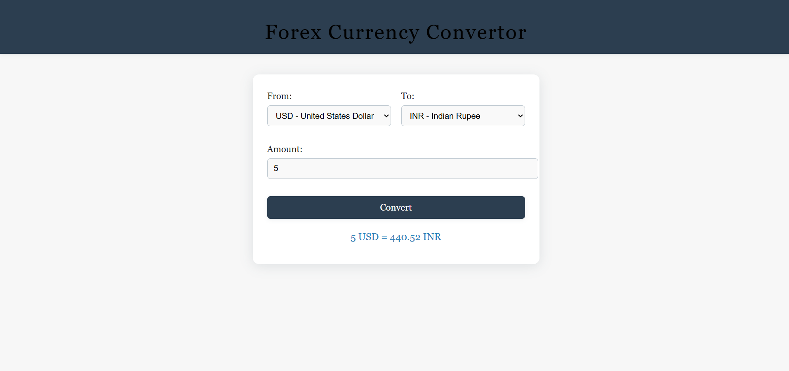

# 💱 Forex Currency Converter

A simple web-based currency converter built with **HTML, CSS, and JavaScript**.  
It uses the [ExchangeRate-API](https://www.exchangerate-api.com/) to fetch real-time exchange rates and supports **161 world currencies**.

---

## 🚀 Features
- Convert between **161 world currencies** 🌍
- Real-time exchange rates using ExchangeRate-API
- Simple and clean user interface
- Responsive design with dropdowns for easy currency selection

---

---

## 🛠️ Technologies Used
- **HTML5** – Structure  
- **CSS3** – Styling  
- **JavaScript (ES6+)** – API calls & DOM manipulation  
- **ExchangeRate-API** – Currency exchange rates  

---

## 📂 Project Structure
├── index.html        # Main HTML file

├── style.css         # Styling

├── app.js            # Conversion logic

├── codes.js     # Currency list (161 codes)

└── README.md         # Project documentation

---

## ⚙️ How to Run
1. Clone the repository:
   ```bash
   git clone https://github.com/mahadevan10/JavaScript-API.git
Open index.html in your browser.

Enter an amount, select currencies, and click Convert.

🔑 API Key Setup


This project uses ExchangeRate-API.

Sign up at ExchangeRate-API (Free plan available).

Get your API key from the dashboard.

Open app.js and replace:

const apiKey = "YOUR-API-KEY";
with your actual key.


⚠️ Note: In production, do not expose API keys directly in frontend code. Use a backend server or environment variables for better security.

🌟 Example Conversion
5 USD = 440.52 INR
📸 Screenshot
✨ Future Improvements
Add support for historical exchange rates

Show conversion charts 📊

Save last used currencies & amount

Dark mode 🌙

📜 License

This project is open-source and available under the MIT License.


This project is open-source and available under the MIT License.

---
